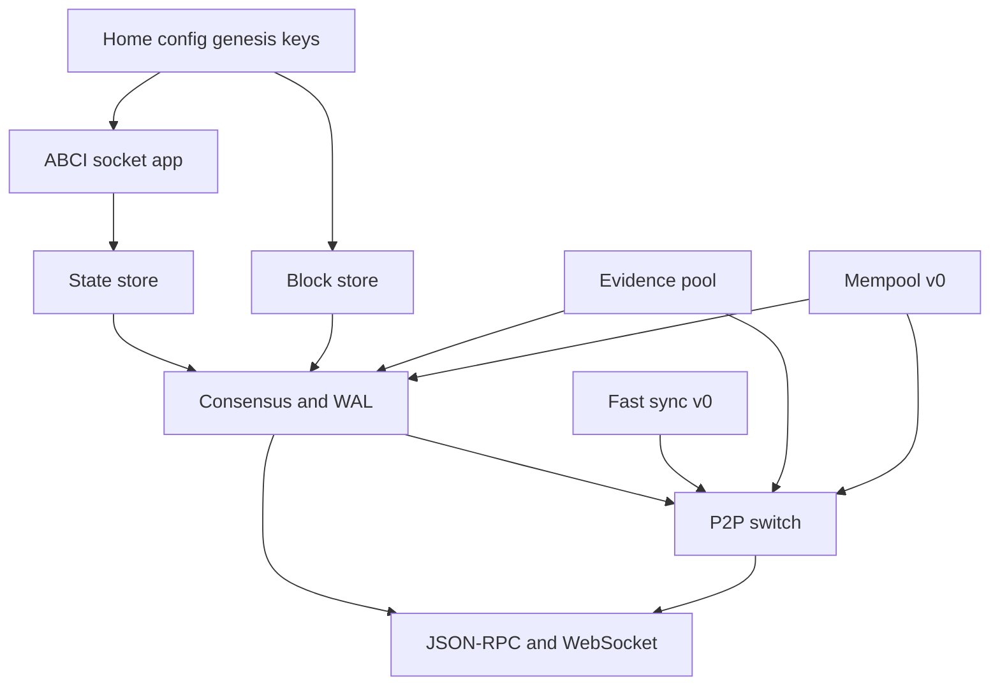

# eld-tendermint-rs

[](https://github.com/eldnetwork/eld-tendermint-rs/actions/workflows/ci.yml)
[](https://github.com/eldnetwork/eld-tendermint-rs/releases/latest)
[](https://github.com/eldnetwork/eld-tendermint-rs/pkgs/container/eld-tendermint-rs)
[](LICENSE)
[](rust-toolchain.toml)

## Purpose

eld-tendermint-rs is a Rust node that runs a Tendermint 0.34 home. It runs consensus, the mempool, the evidence pool, peer networking, an ABCI 0.17 socket client, and JSON-RPC.

`proto/` and `spec/` are copied unchanged from [eld-tendermint](https://github.com/eldnetwork/eld-tendermint) commit `79dcdd71257e56285c3abc2aad5f89e8e2ef02d5` (`v0.34.24-eld.3`). That pin is [`proto/GO_REF`](proto/GO_REF). Those files match upstream Tendermint [v0.34.24](https://github.com/tendermint/tendermint/commit/014cdcf09844d48f6d30f3e520034b7edffd9670). Copyright for that code stays with Tendermint Core. See [NOTICE](NOTICE).

## Compatibility

| | |
| --- | --- |
| Go tree | Eld Tendermint `v0.34.24-eld.3` (`79dcdd7`). Schema matches upstream Tendermint v0.34.24. |
| Version the node reports | `0.34.24` (`status`, and `TM_CORE_SEMVER`) |
| Block protocol | 11 |
| P2P protocol | 8 |
| ABCI | 0.17 socket client |
| Mempool | v0 only |
| Fast sync | v0 only. v1 and v2 are not started. |
| Validator key | File privval, or `priv_validator_laddr` |
| Database | RocksDB. A Go goleveldb `data/` directory will not open. See [Quickstart](#quickstart). |
| JSON-RPC and WebSocket | The methods in [JSON-RPC](#json-rpc). Any other method name returns `-32601`. |

## Non-goals

This repository is a faithful port of that Go tree. Protocol changes for Eld belong in a separate project. This repository does not add them.

## Architecture

`eld-tendermint start` loads one home, dials the ABCI app, opens the stores, then serves RPC.



Peers share these channels: PEX `0x00`, consensus `0x20`–`0x23`, mempool `0x30`, evidence `0x38`, blockchain `0x40`. Fast sync is registered only when `fast_sync` is on and `fastsync.version` is `v0`. A missing `stateKey` calls ABCI `InitChain` once. A restart calls `Info` only.

## Quickstart

Check out the latest release tag.

`--home` wins. If it is omitted, the node uses `TMHOME` when that variable is set, and otherwise `$HOME/.tendermint`. The path in the example below is only the directory you pass to `--home`.

A Go `data/` directory written with `db_backend = "goleveldb"` will not open. RocksDB refuses a directory that has `*.ldb` files, or `CURRENT` and `LOG` without an `IDENTITY` file. Key prefixes match the Go block store (`H:`, `P:`, `C:`, `SC:`, `BH:`, `blockStore`). The RocksDB files on disk do not match a Go goleveldb directory. For a fresh start, keep `priv_validator_state.json` and delete the other files under `data/`. More on this is in [Database](#database).

You bring the config and keys. The process creates the databases. The full layout is in [Home](#home).

```bash
cargo run -p eld-tendermint-node -- start --home $HOME/.eld-tendermint
```

You will see a message that the node cannot connect to the ABCI app. It retries every 3 seconds. Start the ABCI app. Block creation lines follow in the log.

`cargo test --workspace` builds RocksDB, which needs CMake. On macOS, `brew install cmake` is enough. CMake 4.4.3 works.

## Home

These files have to be in place before `start`:

```text
$HOME/.eld-tendermint/
├── config/
│   ├── config.toml
│   ├── genesis.json
│   ├── node_key.json
│   └── priv_validator_key.json
└── data/
    └── priv_validator_state.json
```

`config/priv_validator_key.json` is required unless `priv_validator_laddr` is set. `data/priv_validator_state.json` is required for the file key. `config/addrbook.json` is optional. A missing file starts an empty address book.

`start` creates these under `db_dir` (default `data/`):

- `blockstore/`, `state/`, and `evidence.db/` as RocksDB directories
- `tx_index.db/` unless `[tx_index] indexer` is `null`

The consensus write-ahead log is `data/cs.wal/wal` (the `wal_file` path). At 10 MiB the head is renamed to `wal.NNN` and replaced by an empty file.

## CLI

The binary parses its own arguments. Unknown arguments fail. Each flag accepts `--name value` and `--name=value`.

`eld-tendermint start`

- `--home <dir>` selects the home. See the order in [Quickstart](#quickstart).
- `--proxy-app <addr>` overrides `proxy_app` in `config.toml` for that process.

`eld-tendermint unsafe-reset-all`

- `--home <dir>`, same as `start`.
- `--keep-addr-book` leaves the address book.

The reset deletes `data/` (or the configured `db_dir`) and the address book, writes a height-0 `priv_validator_state.json`, and keeps config and keys. The next `start` calls `InitChain` once.

`eld-tendermint-config`

- `--home <dir>` only.

It prints chain id, moniker, proxy app, and the genesis validator set.

```bash
eld-tendermint start --home /path/to/node
eld-tendermint unsafe-reset-all --home /path/to/node
eld-tendermint-config --home /path/to/node
```

## Docker

The published image is `ghcr.io/eldnetwork/eld-tendermint-rs`. The binary in that image is `eld-tendermint`, the same name as the local binary. Config, genesis, and validator keys are not in the image. Mount them at `TMHOME` (default `/tendermint-rs/.tendermint`). Port 26660 is reserved the way a Go node reserves the Prometheus port. This process does not listen on it.

```bash
docker build -t ghcr.io/eldnetwork/eld-tendermint-rs:local .
```

If `PROXY_APP` is set, the entrypoint passes it as `--proxy-app` for that process. Otherwise `proxy_app` comes from the mounted `config.toml`. This image does not include a kvstore app.

A tag `v0.34.24-eld-tm-rs.N` publishes the image after CI passes. Pushes run CI and do not publish.

## JSON-RPC

`POST /` is the only HTTP JSON-RPC route. Any other method and path is 404, including the Go `GET /status` style URLs. `GET /websocket` upgrades to a WebSocket.

These `POST /` methods are served: `health`, `status`, `genesis`, `validators`, `blockchain`, `net_info`, `consensus_state`, `broadcast_tx_sync`, `broadcast_tx_async`, `broadcast_tx_commit`, `abci_query`, `abci_info`, `block`, `commit`, `tx`, `tx_search`.

Any other method name returns `-32601` and `Method not found`. That includes `block_by_hash`, `block_results`, `genesis_chunked`, `consensus_params`, `unconfirmed_txs`, `num_unconfirmed_txs`, `check_tx`, and `broadcast_evidence`.

A few limits are easy to miss:

- `broadcast_tx_async` and `broadcast_tx_sync` both return the CheckTx code and the transaction hash without waiting for a block. `broadcast_tx_commit` waits for the next committed block, or returns a timeout error.
- `tx_search` accepts equality on `tx.height` and `tx.hash` only. A hash condition wins. Any other tag is an error. With `[tx_index] indexer = "null"` there is no index.
- `status.sync_info.catching_up` is always `false`.
- WebSocket methods are `subscribe` and `unsubscribe` only, and only for `tm.event='NewBlock'` and `tm.event='Tx'`. Another query returns `query is not supported`. Another method returns `-32601`.

## Verify compatibility

`tests/vectors/` holds the hex copied from the Go commit in `proto/GO_REF`. `scripts/refresh-vectors.sh` downloads those Go tests and rewrites the files. `scripts/refresh-vectors.sh --check` fails when the files and that commit disagree. CI runs the check.

`TestABCIResults` and `TestWriteReadMessageSimple` do not embed hex. The script records that, plus the framed `RequestEcho{"Hello"}` bytes. `types/protobuf_test.go` generates keys and has no static hex, so it is not copied.

Re-run the Rust checks with:

```bash
cargo test -p eld-tendermint-proto --test vectors
cargo test -p eld-tendermint-types --test sign_bytes
cargo test -p eld-tendermint-p2p --test secret_connection
cargo test -p eld-tendermint-abci --test frame
```

## Operators

Log lines go to stderr as `LEVEL module=<name> <message> key=value`. Levels are `INFO`, `ERROR`, and `WARN`. A value that contains a space is quoted. There is no tracing subscriber and no Go log format.

`[instrumentation]` is parsed so a Go `config.toml` loads. `prometheus` defaults to false, the listen address defaults to `:26660`, and the namespace defaults to `tendermint`. This node does not open that port and does not export Go metric names.

Proposal, vote, and WAL timestamps use `Time::now()`, which reads `SystemTime`. After genesis, the header time is the median of the last commit. `Instant` is only for timeouts.

The secret-connection ephemeral key comes from `OsRng`. The ChaCha20-Poly1305 nonce starts at zero and increments. Proposal bytes are not randomized.

The WAL frame is a 4-byte Castagnoli CRC32C over the protobuf only, then a 4-byte big-endian length, then the protobuf. Each append is `fsync`ed. The head file rotates to `wal.NNN` at 10 MiB. Replay against a Go WAL depends on that frame.

## CI

The minimum supported Rust is 1.86.0 with edition 2024. Both are pinned in `rust-toolchain.toml` and `[workspace.package]`. CI builds that toolchain, and it is the one this repo supports. Install [gitleaks](https://github.com/gitleaks/gitleaks), [cargo-audit](https://github.com/rustsec/rustsec) 0.22.2+, and [cargo-deny](https://github.com/EmbarkStudios/cargo-deny) (`brew install gitleaks cargo-audit cargo-deny` on macOS).

```bash
./scripts/ci.sh
```

That runs the same checks as GitHub Actions: the tendermint Go-version pin, the vector check, `cargo fmt --check`, Clippy, build, test, `cargo audit`, `cargo deny`, and gitleaks. Rustc and Clippy warnings are treated as errors. A tag runs this workflow before the image job. The image job records the image digest on the GitHub Release for that tag.

Cargo and GitHub Actions updates are manual. The SHA-256 pins for `cargo-audit` and `cargo-deny`, and the pinned `gitleaks` download, are described in [CONTRIBUTING.md](CONTRIBUTING.md).

## What the project covers

- Consensus, with a write-ahead log and gossip to peers.
- ABCI 0.17 socket client.
- Block execution.
- RocksDB block store, with pruning below a retain height.
- P2P switch, with dial, accept, an address book, and PEX.
- v0 mempool.
- v0 fast sync.
- Evidence pool.
- Transaction index.
- File privval.
- Proto messages, Ed25519, and core types for blocks, votes, and evidence.
- `config.toml` and genesis loading.
- The JSON-RPC and WebSocket methods listed above.

Changes so far are listed in [CHANGELOG.md](CHANGELOG.md).

## Crates

Every package is `0.0.1` and unpublished. Each crate has a short README.

| Package | What it matches in the Go tree |
| --- | --- |
| [`eld-tendermint-proto`](crates/proto/README.md) | Prost messages generated from `proto/`. `tests/vectors.rs` checks them against the Go hex vectors. |
| [`eld-tendermint-crypto`](crates/crypto/README.md) | `crypto/tmhash`, RFC-6962 Merkle roots and inclusion proofs, Ed25519 key bytes, Amino JSON, sign and verify. |
| [`eld-tendermint-types`](crates/types/README.md) | Headers, blocks, votes, proposals, validators and proposer priority, `VoteSet` (+2/3), duplicate-vote evidence, genesis, `BitArray`, `PartSet`, `ValidateBasic`, and canonical sign bytes. |
| [`eld-tendermint-config`](crates/config/README.md) | `config.toml` and `genesis.json`. The `eld-tendermint-config` binary prints chain id, moniker, proxy app, and the genesis validator set. |
| [`eld-tendermint-privval`](crates/privval/README.md) | `privval.FilePV`: load a Go validator key and sign a vote or proposal, replaying the same height, round, and step and rejecting conflicting bytes. A set `priv_validator_laddr` dials that signer instead of the local key. |
| [`eld-tendermint-p2p`](crates/p2p/README.md) | `p2p.NodeKey`, the secret-connection handshake, the switch, TCP dial and accept, `addrbook.json`, and PEX on channel `0x00`. |
| [`eld-tendermint-abci`](crates/abci/README.md) | ABCI 0.17 socket client: `echo`, `info`, `check_tx`, `deliver_tx`, `commit`, `query`, `begin_block`, `end_block`, `init_chain`. The ignored live test is documented in `crates/abci/README.md`. |
| [`eld-tendermint-store`](crates/store/README.md) | `store.BlockStore`. Keys are `H:`, `P:`, `C:`, `SC:`, `BH:`, and `blockStore`. `prune_blocks` deletes heights below a retain target after saving the new base. RocksDB on disk, an in-memory map in tests. A Go goleveldb directory is refused. |
| [`eld-tendermint-state`](crates/state/README.md) | `MakeGenesisState`, `InitChain`, and `ApplyBlock`. A missing `stateKey` calls `InitChain` once. A validator update lands in the next set and becomes current one block later. State reloads from `stateKey`. DeliverTx results are indexed under the Go `tx.height` keys. |
| [`eld-tendermint-evidence`](crates/evidence/README.md) | Evidence pool. A duplicate vote is verified against the current or last validator set. A light-client attack is verified against the trusted and common validator sets. Both are stored in `evidence.db`, gossiped on channel `0x38`, and included in one proposal. |
| [`eld-tendermint-mempool`](crates/mempool/README.md) | v0 FIFO mempool. `CheckTx`, reap in arrival order, and recheck. Gossip sends one tx per message on channel `0x30` and does not send that tx back to the peer that sent it. |
| [`eld-tendermint-blockchain`](crates/blockchain/README.md) | v0 fast sync on channel `0x40`. A taller peer is asked for up to 20 blocks. Each block is applied at the next height after its commit matches the previous block. v1 and v2 are not started. |
| [`eld-tendermint-consensus`](crates/consensus/README.md) | In-process rounds, with gossip on channels `0x20`–`0x23`. One and four validators commit height 1, and a locked validator re-proposes that block. A node one or two blocks behind catches up on `0x21` and `0x22` with fast sync off. The WAL is CRC32C-framed. The head stays `cs.wal/wal` and rotates to `wal.NNN` at 10 MiB. A prevote written before rotation is replayed from the older segment without a second signature. |
| [`eld-tendermint-node`](crates/node/README.md) | `eld-tendermint start`. Loads one home (config, keys, RocksDB, ABCI `Info`, `InitChain` on a fresh home, mempool, consensus, evidence, PEX, and v0 fast sync when `fast_sync` is on). A set `priv_validator_laddr` dials that signer and does not read `priv_validator_key.json`. A refused dial exits before RPC starts. A commit `retain_height` prunes block-store heights below that target. Serves the `POST /` methods named in the JSON-RPC section. `GET /websocket` serves `subscribe` and `unsubscribe` for `NewBlock` and `Tx`. `eld-tendermint unsafe-reset-all` deletes `data/` and the address book, keeps config and keys, and writes a height-0 `priv_validator_state.json`. The next start calls `InitChain` once. |

[`tools/proto-compiler`](tools/proto-compiler/README.md) is the prost-build binary used by `scripts/gen-proto.sh`.

## Database

Tendermint 0.34 defaults to goleveldb. goleveldb is a pure-Go port of Google LevelDB. It is the Tendermint 0.34 default because it has no C dependency. RocksDB is Facebook's fork of LevelDB. This Rust port uses RocksDB.

Both are embedded, single-process key-value stores built on a log-structured merge tree. You write batches, read by key, and scan ranges. Compaction runs in the background.

The same warning is in the [quickstart](#quickstart): a Go `data/` directory created with `db_backend = "goleveldb"` will not open under RocksDB.

- Key prefixes match the Go block store (`H:`, `P:`, `C:`, `SC:`, `BH:`, `blockStore`). The directory does not.
- Tests use the in-memory `Db`. The node writes RocksDB files in its own directory.
- blockstore, state, evidence, and tx_index stay separate databases, as in the Go node. `eld-tendermint start` opens `blockstore`, `state`, `evidence.db`, and `tx_index.db` unless `[tx_index] indexer` is `null`.
- `eld-tendermint unsafe-reset-all` deletes `data/` and the address book, and keeps `config.toml`, genesis, and the node and validator keys. `--keep-addr-book` leaves the address book. The reset home itself can be started by either binary. The `data/` files the next Rust `start` creates are RocksDB and cannot be opened by the Go node.

## Proto

`proto/` is the schema. `crates/proto/` is the Rust library generated from it.

`proto/` is copied unchanged from the commit in `proto/GO_REF` (`79dcdd71257e56285c3abc2aad5f89e8e2ef02d5`). It holds the 24 `.proto` files under `proto/tendermint/` plus `proto/third_party/gogoproto/gogo.proto`. These files are the source of truth for field numbers and message layout (ABCI 0.17.0). They match upstream Tendermint v0.34.24. Cargo does not compile this directory. `scripts/gen-proto.sh` reads it and writes Prost output.

`crates/proto/` is the Cargo package `eld-tendermint-proto`. `src/prost/*.rs` is the generated output, and `src/lib.rs` exposes it as `eld_tendermint_proto::abci`, `::types`, and the other packages. Later crates depend on this package.

Edit `proto/tendermint/**` only when the Go schema changes, then regenerate. Do not hand-edit `crates/proto/src/prost/`.

How the hex fixtures are copied, and how to re-run them, is in [Verify compatibility](#verify-compatibility).

Amino JSON for keys, the privval files, and `node_key.json` is implemented on the hand-written types. Prost ignores `jsontag` and `customname`, so the generated messages do not carry those names.

`tendermint-rs` (`tendermint-proto` 0.40) already has Prost types for this ABCI shape, under `tendermint_proto::v0_34`. This repo does not depend on that crate:

- Its `v0_34` module was generated from CometBFT `v0.34.35`, which is not Tendermint v0.34.24.
- The crate root re-exports CometBFT 0.38 (`pub use v0_38::*`), so `tendermint_proto::abci` is `FinalizeBlock`-era ABCI.
- `tendermint-abci` in that repo speaks the 0.38 socket codec.
- Those bindings are not tested against Eld’s Go hex vectors.

We copied the generator settings from `tendermint-rs`, not the library. The generator uses Prost 0.13. ABCI byte fields are the `bytes` type. `Timestamp` and `Duration` use Prost's own types instead of being generated from the schema.

## Spec

`spec/` is copied unchanged from that same commit (`79dcdd71257e56285c3abc2aad5f89e8e2ef02d5`, recorded in `proto/GO_REF`). The markdown, TLA+, TeX, and Ivy files are left as they are. A short local note at the top of [spec/README.md](spec/README.md) says what each language is. Do not edit the spec body here.

## Still to do

- JSON-RPC methods other than the ones named in [JSON-RPC](#json-rpc). A call to any other method returns `-32601`.
- v1 and v2 fast sync. The node starts fast sync only when the version is `v0`.
